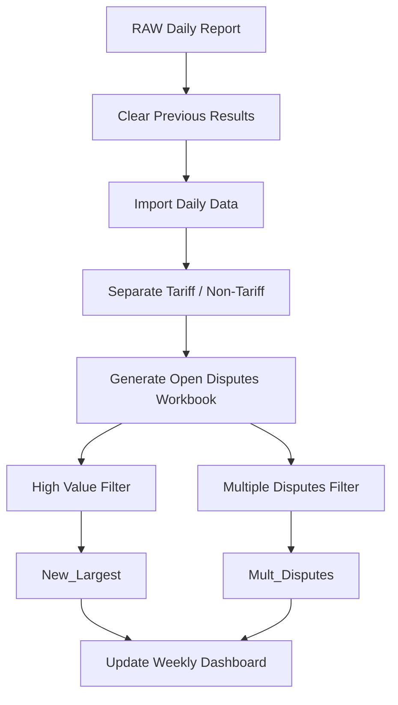
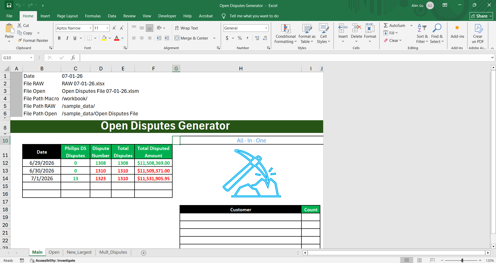
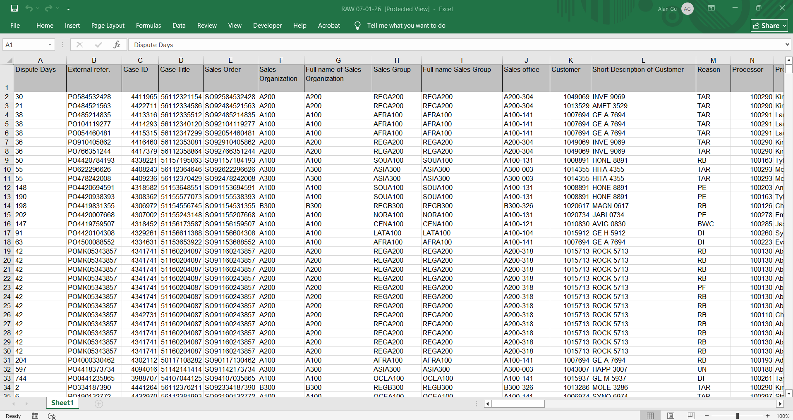
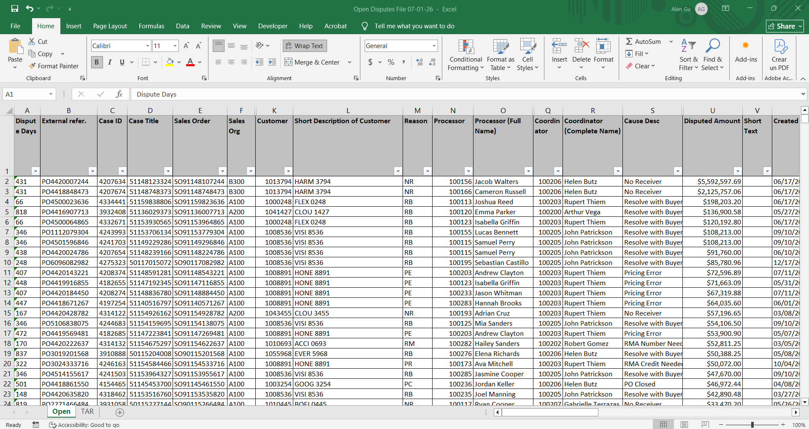
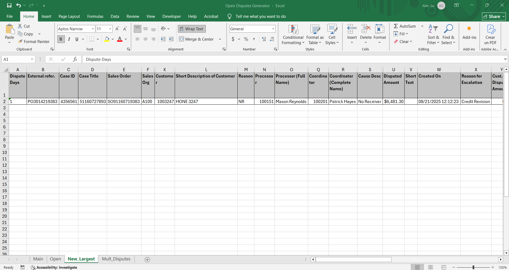
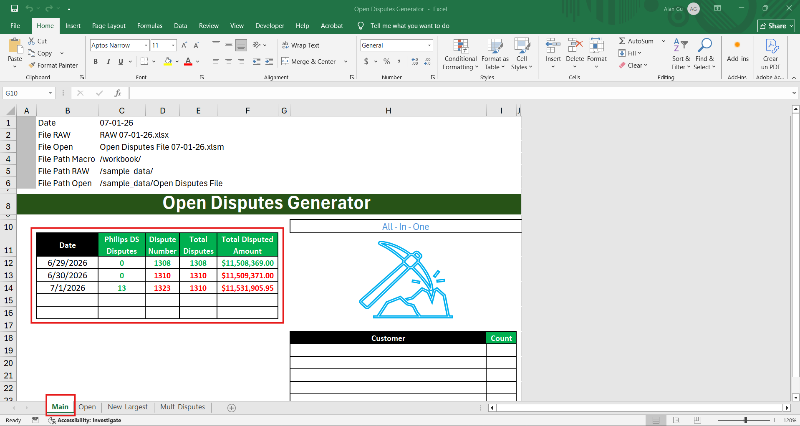

# Open Disputes Automation

## 📊 Project Overview
This VBA automation streamlines the daily processing of customer dispute data by cleaning raw reports, separating tariff and non-tariff disputes, identifying high-priority cases, and generating management-ready reports.

The macro processes the daily RAW dispute export, automatically categorizes disputes based on business rules, creates summary workbooks, identifies newly created high-value disputes and accounts with unusually high dispute volumes, and updates a weekly dashboard with key operational metrics.

By automating multiple manual reporting tasks, the solution significantly reduces processing time while improving reporting consistency and accuracy.

## 📂 Dataset Description
The automation processes a daily dispute report exported from the ERP system.

    Example input file: RAW 07-01-2026.xlsx
    - The dataset includes information such as:
        - Dispute Reason
        - Customer Account
        - Customer Name
        - Customer Sales Group
        - Invoice Number
        - Dispute Number
        - Disputed Amount
        - Invoice Date
        - Dispute Creation Date
        - Purchase Order
        - Sales Order
        - Dispute Owner

## ⚙️ Automation Workflow
The automation follows a structured reporting workflow.
1. Reset Previous Results
    - Before importing new data, the macro clears existing information from the following worksheets:
        - Open
        - New_Largest
        - Mult_Disputes
    - This ensures each execution starts with a clean workspace.

2. Load Daily Raw Report
    - The macro automatically opens the latest daily RAW dispute report.
    - The report is imported into the automation workbook for processing.

3. Categorize Disputes 
    - Using the Dispute Reason field, disputes are classified into two groups.
    - Tariff-related disputes
        - Reasons include:
            - TAR
            - DCP
            - DPI
    - Non-tariff disputes
        - All remaining dispute reasons.
    - The macro copies only the non-tariff disputes into the Open worksheet for further analysis.

4. Generate Open Disputes Workbook
    - A new workbook is automatically created.
        - Example: Open Disputes File 07-01-26.xlsx
    - The workbook contains:
        - Tariff-related disputes "TAR" worksheet
        - Non-tariff disputes "Open" worksheet
    - This provides a clean operational report for downstream users.

5. Identify New High-Value Disputes
    - The automation filters the Open worksheet using the following criteria:
        - Dispute Days = 0 or 1
        - Disputed Amount > $5,000
    - Matching disputes are copied into the New_Largest worksheet.
        - This report highlights newly created disputes with significant financial exposure.

6. Detect Accounts with Multiple New Disputes
    - The macro returns to the Open worksheet and applies an additional business rule.
    - Criteria:
        - Dispute Days = 0
        - Customer Account has 15 or more newly created disputes
    - Matching records are copied into the Mult_Disputes worksheet.
    - This report helps identify customers generating unusually high dispute volumes.

7. Update Weekly Dashboard
    - The automation updates the summary table located in the Main worksheet.
    - The dashboard tracks:
        - Report Date
        - Philips DS Disputes
        - Number of Disputes
        - Total Open Disputes
        - Total Disputed Amount

    - Business logic:
        - Monday clears the previous week's dashboard and starts a new reporting cycle (Row 12).
        - Tuesday through Friday populate the corresponding weekday rows automatically.

    - This creates a continuously updated weekly operational summary.

## 📈 Project Highlights
- Automated daily dispute processing
- Business rule-based dispute categorization
- High-value dispute identification
- Multiple-dispute account detection
- Automated workbook generation
- Weekly dashboard updates
- Standardized operational reporting
- Reduced manual filtering and copying

## 📈 Workflow

### Macro Execution
- The animation below demonstrates the complete automation workflow.

### Source Workbook

### Generated Open Disputes File

### New Largest

### Weekly Dashboard

NOTE: the sample files included in this repository contain anonymized data to protect confidential business information.

## 🛠️ Technologies Used
- Microsoft Excel VBA
- Excel Object Model
- Workbook Automation
- Worksheet Manipulation
- AutoFilter
- Advanced Filtering
- Conditional Business Rules
- Dictionaries
- File System Operations
- Dashboard Automation

## 💼 Business Impact
This automation replaces a repetitive manual reporting process with a standardized workflow that delivers consistent daily operational reports.

Key Benefits: 
- Reduces daily report preparation time from hours to minutes
- Eliminates repetitive manual filtering and copying
- Standardizes dispute categorization
- Highlights financially significant new disputes
- Identifies customers with unusually high dispute activity
- Produces management-ready reports automatically
- Maintains a continuously updated weekly operational dashboard
- Scales efficiently to large daily dispute datasets

## ▶️ How to Run
1. git clone https://github.com/alangudi417/open-disputes-report-automation.git
2. Open the Excel macro-enabled workbook.
    - Enable macros.
    - Place the daily RAW dispute report in the sample_data folder.
3. Run the Open Disputes macro.
    - The automation will:
        - Clear previous results
        - Import the daily dispute report
        - Separate tariff and non-tariff disputes
        - Generate the Open Disputes workbook
        - Identify high-value new disputes
        - Detect accounts with multiple new disputes
        - Update the weekly dashboard automatically